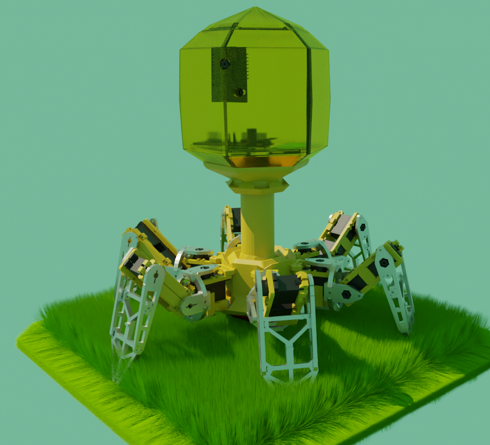
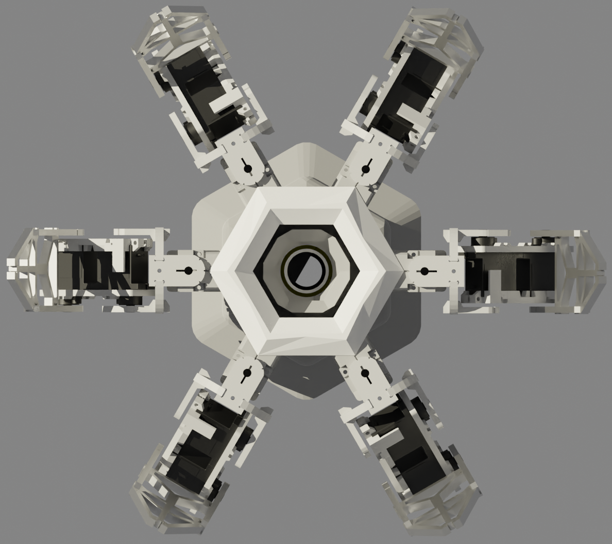
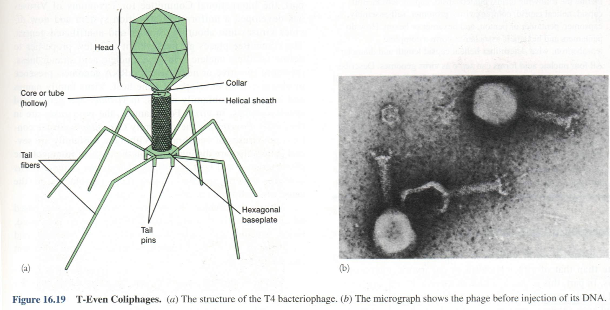
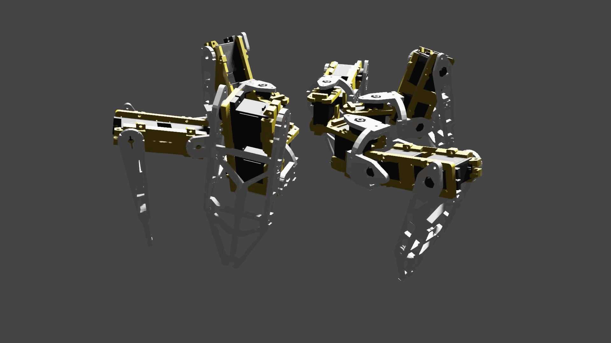
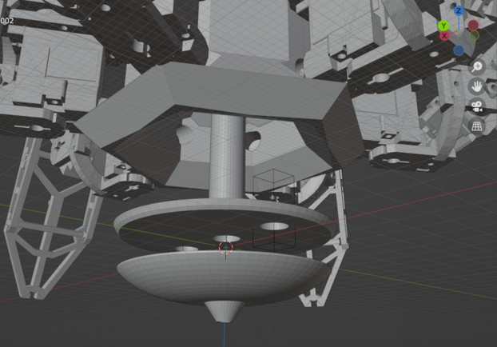

# Robophage  
**仿噬菌体的6足机器人**  
***
    
***
## How to say: Imitate the phage？
### 大致外形
   
如图，直观来讲，噬菌体的结构最明显的是头部，“Helical sheath”，Hexagonal baseplate，Tail fibers，当然Tail pins也是很重要的部分。
### 生理功能
我们都知道噬菌体是一种病毒，最常见的即以大肠杆菌为寄主的T2噬菌体。[当噬菌体T2感染大肠杆菌时，它的尾部吸附在菌体上。然后，菌体内形成大量噬菌体，菌体裂解后，释放出几十个乃至几百个与原来感染细菌一样的噬菌体T2。](http://zhidao.baidu.com/question/370795825/answer/3064369381)  
  
当然，这样的机器人怎么可能侵入什么东西来实现自己的复制？所以从“注入DNA”这里模仿也许比较合适。  
***
## 使用的工具/材料
|       |**Blender**|**Python**|
|:----- |:-----:|:----:|
|简介   |开源免费建模动画软件|解释型编程语言|
|special|强大的开源社区|简洁性、易读性以及可扩展性|
|Value  |建模、制作anime|Processing images and [监听键盘](https://blog.csdn.net/coco56/article/details/107847467) |
|       |**[RaspberryPi](https://pico.org.cn/)**|**[ESP32cam](https://docs.ai-thinker.com/esp32-cam)**|
|简介    |support programming in C or in micropython|小尺寸摄像头模组 |
|special|rp2040|Wifi|
|Value  |main computing chip|Wireless Images Transmission|
|       |**PCA9685**|**[微型隔膜泵](https://m.tb.cn/h.fEWZDlZ?tk=fhnS2oLF5j6)**|
|简介    |16路舵机控制板iic通信|足够迷你的5v驱动隔膜泵|
|special|iic|5v工作|
|Value  |control 16 servos|water operation|
|       |**[转压模块](https://m.tb.cn/h.fvNk34G?tk=g5z52MGwKzn)**|**3s航模锂电池**|
|简介    |in:7V~28V out:5V3A,1.5A if have worked for a long time|about 11.1v|
|special|5V3A|11.1V|
|Value  |转出工作电压|作为总电源|
|       |**[无线串口模块DL-20](https://item.taobao.com/item.htm?spm=a230r.1.14.24.12c4259eXgpoSP&id=573882263589&ns=1&abbucket=4#detail)**||
|简介    |zigbee通信，即插即用||
|special|点对点通信或广播通信||
|Value  |电脑与单片机的通信||  
## 实现原理  
### 步态
#### 步态动画  
单腿半圆形轨迹动画  
  
3角步态动画  
  
#### 步态说明  
> 待编辑  
### 水操作  
#### 取水注水  
  
#### 结构说明  

### 视觉识别追踪  
#### 测试动图  
  
#### 方法  
物体识别直接使用yolov5开源[coco数据集](https://blog.csdn.net/qq_41185868/article/details/82939959)模型，手势识别使用Google开源机器学习框架[mediapipe](https://mediapipe.dev/)的手部关键点检测。计算分析手势为伸出食指时，将食指的图像投影坐标相对图像中心点的x、y轴偏移量转化为指令发送给机器人调整姿态实现追踪。  
## Start Building  
> 持续优化改进...  
### code  
#### RaspberryPi Pico  
  把resource/code/pico内，main.py所在的路径作为根路径，烧写在RaspberryPi Pico上，上电自动运行。  
settings.py是设置文件  
**main.py**中的循环前的语句有配置详情，根据这些代码可以知道如何接线。  
#### Personal Computer  
  resource/code/Controller，内含yolo，所以带了一份[yolo6.1](https://github.com/ultralytics/yolov5/releases/tag/v6.1)的requirements.txt  
  运行**user.py**
***
### Parts of the machine  
#### Body  
使用blender建模，身体中间有一条竖直的管道，用于存储、传输物质或又可加装拓展设备，例如激光、燃气焊枪、机械爪、伸缩式探头、马克笔，甚至是螺旋桨、火箭推进器等。  
头部也有足够的空间（相对的比例来说），可安装高性能计算单元。  
#### Leg  
使用开源项目“[hexapod，这里给一个python版传送门](https://github.com/ViolinLee/PiHexa18)”的腿，正六边形插入式安装。
关节动力目前采用舵机。  
#### 3d模型  
> StlFiles  
>> Body  
>> Leg  
>> SmallParts  
***
## 效果视频  
目前有如下的效果：  
[B站NowLoadY 仿噬菌体的6足机器人](https://www.bilibili.com/video/BV1Ng41197Ls?share_source=copy_web)  
