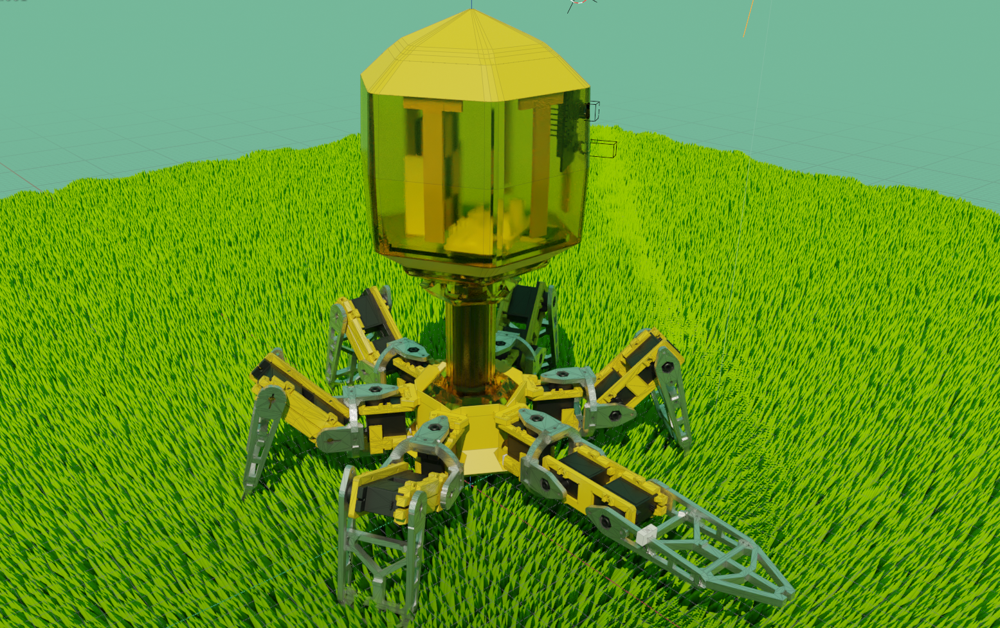

# Robophage  
仿噬菌体的6足机器人  
  
## Start Building  
### code  
把resource/code/pico内，main.py所在的路径作为根路径，烧写在RaspberryPi Pico上，上电自动运行。  
settings.py是设置文件，其余文件夹可以翻一下  
main.py中的循环前的语句有配置详情，根据这些代码可以知道如何接线。
### Parts of the machine  
3d模型整理后上传
